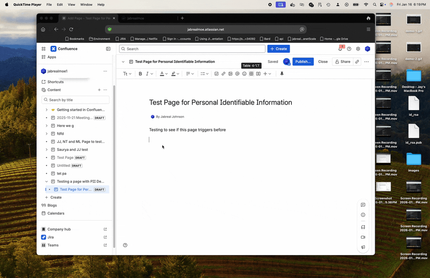
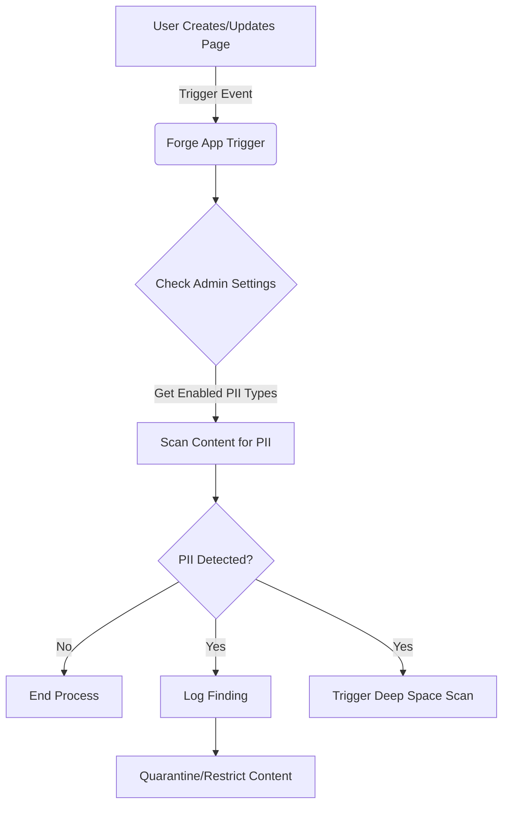
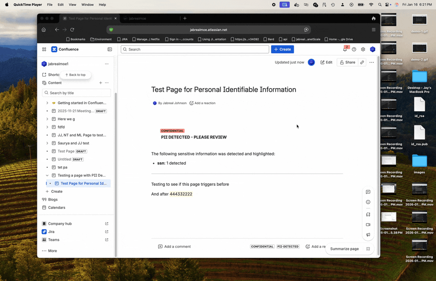

# Confluence PII Detector


This Forge app acts as an intelligent guardian for your Confluence content, automatically scanning pages for Personally Identifiable Information (PII). It allows organizations to maintain data security and compliance by proactively identifying sensitive data leaks within the "Garden" of your knowledge base.

## Features

- **Real-time PII Detection**: Automatically scans page content when created or updated.
- **Configurable Detectors**: Administrators can enable or disable specific PII detectors via the Admin Interface.
- **Regulated User Control**: Option to restrict actions (mentions, comment editing) for specific user groups.
- **Deep Space Scanning**: If PII is found, triggers broader scans to identify widespread issues.

### PII Detection in Action


_The app detects SSNs, highlights the data, and automatically labels the page._

## Application Flow

The following diagram illustrates how the application processes Confluence page events:




## Configuration

## Configuration

1. **Deploy and install the app**:

   ```bash
   forge deploy
   forge install
   ```

## Admin Interface Usage

The application includes a dedicated Admin Interface for granular control over PII detection.

**To access the Admin Interface:**

1. Navigate to your Confluence Apps management or global settings.
2. Select **PII Configuration**.



**Available Settings:**

### PII Detection Rules

Toggle the checkboxes to enable or disable scanning for specific types of data:

- **Email Addresses**
- **Phone Numbers**
- **Credit Card Numbers**
- **Social Security Numbers (SSN)**
- **Passport Numbers**
- **Driver's Licenses**

### Regulated User Control

- **Regulated Group Name**: Enter the name of a Confluence user group (e.g., `contractors`).
  - _Effect_: Users in this group will be restricted from using `@mentions` and editing comments to prevent unauthorized data dissemination or modification.

## Development

- Run the app locally for testing and development:
  ```bash
  forge tunnel
  ```
